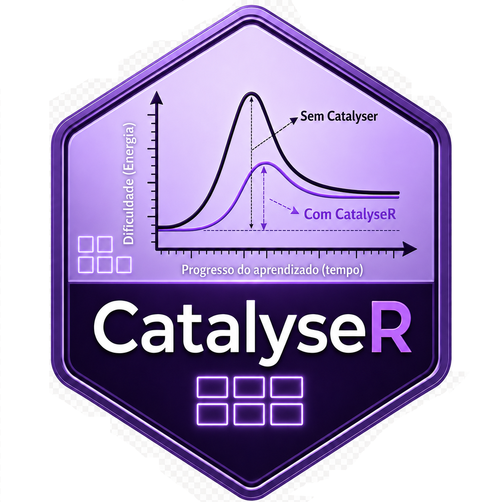

::: {.callout-note .destaque icon=false}
## Já passou por isso?

Você sentou para fazer uma análise simples — comparar o peso de peixes de dois cultivos — e, antes de qualquer estatística, perdeu a tarde com mensagens de erro vermelhas, pacote que não instala, "Rtools não encontrado". Quando o ambiente finalmente funcionou, a vontade de analisar já tinha ido embora. A boa notícia: isso se resolve **uma vez**. Depois, a bancada está pronta e você só pensa nos dados.
:::

Neste livro, a estatística começa no **mouse** (na IDE CatalyseR) e termina no **código**, dentro do R. Para que essa ponte funcione, precisamos de uma bancada bem montada. Este capítulo monta essa bancada no Windows, peça por peça, e deixa tudo testado. Não é a parte glamourosa, mas é a que evita dor de cabeça em todos os capítulos seguintes.

## As quatro peças (e o que cada uma faz)

Pense numa oficina. Você não usa uma ferramenta só; usa um conjunto que conversa entre si. Nossa oficina de análise tem quatro peças:

O **R** é o **motor**: a linguagem que faz as contas, ajusta os modelos e desenha os gráficos. O **RStudio** é o **painel de controle**: a tela confortável de onde você dirige o motor, vê os dados, os gráficos e os resultados lado a lado. O **Rtools** é a **caixa de ferramentas de fábrica** do Windows: alguns pacotes do R chegam "em peças" e precisam ser montados (compilados) na sua máquina; sem o Rtools, eles não montam. E o **Quarto** é a **gráfica**: transforma a sua análise (texto + código + resultados) em um relatório bonito, em PDF, Word ou página web.

> **Por que o Rtools só no Windows?** No macOS e no Linux a "caixa de ferramentas" de compilação já costuma vir com o sistema. No Windows, ela é instalada à parte; por isso este capítulo dá atenção especial a ela.

## Instalando, na ordem certa

A ordem importa: o Rtools precisa **casar** com a versão do R. Instale assim:

1. **R**: baixe a versão mais recente em [cran.r-project.org](https://cran.r-project.org) (Windows → *base* → *Download R for Windows*). Anote a versão (ex.: 4.x).
2. **RStudio**: baixe o *RStudio Desktop* (gratuito) em [posit.co/download/rstudio-desktop](https://posit.co/download/rstudio-desktop). Ele encontra o R automaticamente.
3. **Rtools**: baixe a versão de Rtools **correspondente à do seu R** em [cran.r-project.org/bin/windows/Rtools](https://cran.r-project.org/bin/windows/Rtools/). Aceite as opções padrão do instalador.
4. **Quarto**: baixe em [quarto.org/docs/get-started](https://quarto.org/docs/get-started/). O RStudio recente já vem com Quarto embutido, mas instalar a versão oficial garante o motor mais novo.

Feche e reabra o RStudio depois de instalar o Rtools: assim ele "enxerga" a caixa de ferramentas nova.

::: {.callout-important .destaque icon=false}
## Atenção no Windows: biblioteca gravável e instalação como administrador

Duas precauções evitam a maioria das dores de cabeça com permissões no Windows.

Primeiro, **instale o R numa pasta gravável**. No caminho padrão (`C:\Program Files\R\...`), a pasta da biblioteca de pacotes fica protegida pelo sistema, e o `install.packages()` acaba caindo numa "biblioteca pessoal" escondida — ou falhando com erros de permissão (`'lib = ...' is not writable`). A solução mais tranquila é criar uma pasta simples, como **`C:\R`**, e apontar o instalador do R para ela (no instalador, troque o diretório de destino para `C:\R\R-4.x.x`). Assim a sua biblioteca fica sob seu controle, sem pedir privilégios a cada novo pacote.

Segundo, **instale as quatro peças como administrador** (clique com o botão direito no instalador → *Executar como administrador*): o **R**, o **RStudio**, o **Rtools** e o **Quarto**. Isso garante que os atalhos, as variáveis de ambiente e o registro do Windows fiquem corretos para todos os programas se encontrarem.

Se, mesmo assim, a pasta `...\R\R-4.x.x` continuar protegida, abra as **Propriedades** dela → aba *Segurança* e conceda **Controle total** (escrita) ao seu usuário.
:::


## Testando o Rtools (com um único pacote)

Não confie; **verifique**. Em vez de descobrir que o Rtools não funciona só lá na frente, testamos agora. Instalamos **um** pacote — o `pkgbuild` — e pedimos a ele que tente compilar um programinha. Se a oficina estiver completa, ele responde que sim.

```{r}
#| eval: false
install.packages("pkgbuild")
pkgbuild::has_build_tools(debug = TRUE)
```

Se aparecer `TRUE` (e nenhuma reclamação sobre ferramentas ausentes), o Rtools está pronto.

E não se preocupe: o `pkgbuild` não é um pacote "descartável". Ele é justamente a engrenagem que o `remotes` e o `devtools` usam para **construir pacotes a partir do código-fonte**, exatamente o que acontece quando você instala um pacote do GitHub (como o `EAPADados`, daqui a pouco) ou um pacote escrito em C/C++. É nesses casos que o Rtools entra em ação. Pacotes que já chegam prontos (binários do CRAN, como o `jsonlite`) ou feitos só em R (como o `psych`) **não** exercitam o Rtools; por isso o teste do `pkgbuild`, que compila um programinha de verdade, é o mais confiável de todos.

## Os pacotes do ambiente de análise

O R "puro" já faz muita coisa, mas o trabalho fica bem mais agradável com alguns pacotes de apoio. Estes são os do **ambiente geral**, que você vai usar o tempo todo, em quase todos os capítulos:

```{r}
#| eval: false
install.packages(c(
  "tidyverse",  # manipular dados e fazer gráficos (dplyr, ggplot2, tidyr, readr...)
  "ggpubr",     # gráficos prontos para publicação, com aparência limpa
  "readxl",     # ler planilhas .xlsx
  "janitor",    # limpar nomes de colunas (clean_names) e arrumar tabelas
  "rio",        # importar/exportar vários formatos com um comando só
  "here",       # montar caminhos a partir da raiz do projeto
  "rprojroot",  # localizar a raiz do projeto (motor por trás do here)
  "fs"          # manipular arquivos e pastas de forma robusta e multiplataforma
))
```

Os três últimos (`here`, `rprojroot` e `fs`) merecem uma palavra, porque são a base da **reprodutibilidade**. Em vez de escrever caminhos fixos como `C:/Users/voce/dados/peixes.csv` (que quebram no computador de qualquer outra pessoa), eles encontram a **raiz do projeto** e montam caminhos relativos que funcionam em qualquer máquina e em qualquer sistema. Você vai usá-los já no próximo capítulo, quando organizarmos um projeto de análise de verdade.

> **Atenção ao escopo.** Aqui ficam só os pacotes de uso **geral**. Os pacotes de **dependência** do `EAPADados` e da CatalyseR vêm junto quando você instala esses dois (próxima seção); não precisa instalar à mão. E os pacotes **específicos de um capítulo** (por exemplo, `sf`/`leaflet` para mapas, ou `forecast` para séries temporais) são pesados e nem todo leitor vai usar: instale-os **quando chegar ao capítulo**, não agora. À medida que o livro crescer, esta lista geral pode ganhar um ou outro item, mas o princípio continua: a bancada geral leve, o específico sob demanda.

## O pacote do livro: EAPADados

Todos os exemplos deste livro usam dados reais de pesca e aquicultura, reunidos no pacote **`EAPADados`**. Ele não está no CRAN; instalamos direto do GitHub com a ajuda do `remotes`:

```{r}
#| eval: false
install.packages("remotes")
remotes::install_github("astuciasnor/EAPADados")
```

Pronto: a partir daqui, sempre que um capítulo disser `data(nome)` ou
`EAPADados::nome`, os dados estarão à mão. Falta a última peça, e a mais
importante para este livro: a **CatalyseR**, a IDE que abre a análise no mouse.

## A IDE do livro: instalando a CatalyseR

A **CatalyseR** (@fig-logo-catalyser) é o coração do nosso método: é nela que você faz a análise apontando e clicando e, ao final, leva embora o **script R** que a reproduz e um **relatório pronto**. Como o `EAPADados`, ela também mora no GitHub e não no CRAN. Mas, diferente de um pacote de dados, a CatalyseR é um **aplicativo** (construído em Shiny) e traz mais dependências junto; por isso vale instalar com um pouco de cuidado, para não tropeçar.

{#fig-logo-catalyser width=25% fig-align="center"}

O segredo para a instalação não falhar é um só: **comece numa sessão limpa e com os utilitários atualizados**. Boa parte dos erros ao instalar pacotes do GitHub não vem do pacote em si, mas de uma engrenagem auxiliar **desatualizada e já carregada** na memória do R. O exemplo mais comum é o pacote `xfun` (uma peça que o `knitr` e o `markdown` usam para gerar relatórios): se uma versão antiga dele já estiver carregada, o R interrompe a instalação com mensagens como *"namespace 'xfun' x.y is being loaded, but >= a.b is required"* ou *"cannot remove prior installation of package 'xfun'"*. A cura é simples: atualizar esses utilitários antes, numa sessão recém-aberta.

Faça assim, em uma sessão nova do R (no RStudio, menu *Session → Restart R*), **sem carregar nenhum pacote ainda**:

```{r}
#| eval: false
# 1) Atualize os utilitários que a CatalyseR e seus relatórios usam.
#    Um xfun antigo já carregado é a causa nº 1 de falha de instalação.
install.packages(c("remotes", "xfun", "knitr", "markdown"))

# 2) Instale a CatalyseR do GitHub. As demais dependências
#    (shiny, bslib, DT, ggplot2, readxl) vêm junto, automaticamente.
remotes::install_github("astuciasnor/catalyser")
```

Se o R perguntar se quer atualizar outros pacotes durante a instalação, prefira atualizar (responda *All*, opção 1). E, se ele reclamar que **não consegue remover** um pacote porque está "em uso", reinicie o R outra vez e repita, sempre sem carregar pacotes antes. No Windows, é esse "pacote em uso", com o arquivo travado, que causa a maioria dos sustos; a sessão limpa resolve.

Vale lembrar de duas peças que você já montou e das quais a CatalyseR depende: o **Rtools** (caso alguma dependência precise ser compilada; veja a seção de teste, mais atrás) e o **Quarto** (que a IDE usa para gerar os relatórios). Com a bancada deste capítulo pronta, ela tem tudo de que precisa.

Instalada, a interface abre no seu navegador com dois comandos:

```{r}
#| eval: false
library(catalyser)
run_app()   # abre a CatalyseR no navegador
```

### Um tour pela tela

A @fig-catalyser mostra a CatalyseR aberta. Vale reconhecer as quatro regiões, porque elas se repetem em todos os capítulos do livro.

![A interface da CatalyseR. No alto, a logo e o **menu de análises**, o catálogo do curso (preparar e descrever dados, regressão, testes paramétricos e não paramétricos, multivariada e mais). À esquerda, o **carregamento de dados**: um arquivo local (CSV/Excel) ou um conjunto do próprio `EAPADados`. No centro, os **dados e resultados**. À direita, o **status** e o botão **Exportar Projeto Consolidado**, que empacota a análise num Projeto R (.zip) com os scripts e um relatório Quarto: é a ponte "do mouse ao código".](../../images/catalyser_interface.png){#fig-catalyser width=100%}

No **alto** fica o menu de análises: é o catálogo do livro, e cada item corresponde a um capítulo. À **esquerda**, você carrega os dados, de um arquivo seu ou direto do `EAPADados`. No **centro**, vê os dados e, conforme avança, os resultados (tabelas e gráficos). E à **direita**, além do status do conjunto, está o botão que dá sentido a tudo: **Exportar Projeto Consolidado**. Ele gera um `.zip` organizado, com os dados, os `scripts/` R numerados e um `relatorio.qmd`, exatamente no formato de projeto que veremos no próximo capítulo. Você clicou, analisou e saiu com o código na mão. É esse o caminho que o livro inteiro percorre.

## Resumo do capítulo {.unnumbered}

> Monte a bancada **uma vez**: R (motor), RStudio (painel), Rtools (oficina, no
> Windows) e Quarto (gráfica), nessa ordem, com o Rtools casando a versão do R.
> **Teste** o Rtools com `pkgbuild::has_build_tools()`. Instale os pacotes
> **gerais** (`tidyverse`, `ggpubr` e os de leitura) e o pacote de dados do livro
> (`EAPADados`). Por fim, instale a **CatalyseR** numa **sessão limpa** e com os
> utilitários (`xfun`, `knitr`, `markdown`) atualizados antes, para a instalação
> não falhar, e abra-a com `run_app()`. Deixe os pacotes **específicos de cada
> capítulo** para a hora em que forem usados.

## Para praticar {.unnumbered}

1. Rode `pkgbuild::has_build_tools(debug = TRUE)` e confirme que o resultado é `TRUE`.
2. Carregue o `tidyverse` com `library(tidyverse)` e veja a lista de pacotes que ele traz junto.
3. Instale o `EAPADados`, rode `library(EAPADados)` e liste os dados disponíveis com `data(package = "EAPADados")`.
4. Numa sessão limpa do R, instale a `catalyser` (atualizando antes `xfun`, `knitr` e `markdown`), depois rode `library(catalyser); run_app()` e confira se a interface abre no navegador.