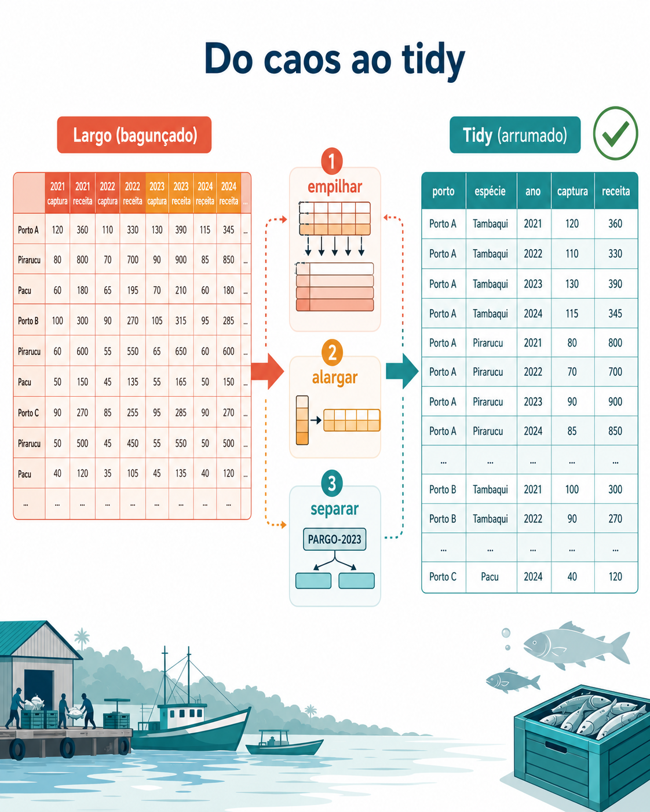

```{r setup}
#| include: false
library(EAPADados)   # dados e funções canônicas do ecossistema EAPA
library(dplyr)
library(tidyr)
library(flextable)

# Paleta da identidade visual Ocean Gradient
ocean <- c("#0F3B5F", "#2E7D8F", "#62B6B7", "#E89B3C", "#E76F51")

# Conjuntos de treino do ecossistema (sintéticos, feitos para aprender a arrumar)
data(treino_desembarque)   # formato LARGO: colunas do tipo "2021 - Captura_t"
data(treino_coletas)       # coluna COMPOSTA: "PARGO-2023-BRA"
```

::: {.callout-note .destaque icon=false}
## Já passou por isso?

Você baixou a planilha do desembarque pesqueiro e abriu cheio de esperança. Aí veio o balde de água fria: dezenas de colunas com nomes como `2021 - Captura_t`, `2021 - Receita_mil`, `2022 - Captura_t`… uma coluna nova para cada ano e cada medida. Você quer só fazer um gráfico da captura ao longo do tempo, mas o R não entende essa bagunça. E agora?
:::

A boa notícia é que essa dor tem cura, e a cura é rápida. No fim deste capítulo, aquela planilha teimosa vai virar um conjunto de dados organizado — e a receita que fez isso caberá em três linhas de código que você pode guardar e reusar todo ano. Melhor: você vai montar essa receita **no mouse**, dentro da CatalyseR, e sair com o script `.R` pronto.

Antes de qualquer teste, antes de qualquer gráfico bonito, existe uma etapa que quase ninguém conta nos livros: **arrumar os dados**. É a parte silenciosa do trabalho, a que dá menos glória e toma mais tempo. Mas é também onde as boas análises começam. Uma planilha bem arrumada chega **pronta** para o teste; uma planilha bagunçada contamina tudo que vem depois. Este capítulo é sobre transformar a primeira na segunda, com método.

O preparo completo tem cinco passos, sempre nesta ordem: **importar → arrumar → filtrar → tipar → recodificar** — a mesma sequência do menu *Preparando Dados* da CatalyseR. Os extremos você já conhece do Capítulo 3: importar os dados e dar-lhes os tipos certos. Aqui a gente foca no **coração**: *arrumar*, ou seja, dar aos dados a forma que a análise espera — e na ferramenta que faz isso brilhar, as **expressões regulares** (regex). A @fig-preparo resume o percurso: da planilha larga e teimosa até os dados *tidy*, prontos para analisar.

{#fig-preparo width=85%}

## Os dados de treino

Para aprender a arrumar, nada de dados perfeitos. Precisamos de dados com os defeitos típicos do mundo real — só que pequenos e previsíveis, para você conseguir seguir cada passo com os olhos. Por isso o `EAPADados` traz dois conjuntos com o prefixo `treino_`, sintéticos e propositalmente "mal-arrumados", cada um treinando um tipo de arrumação.

O primeiro, `treino_desembarque`, imita um relatório de produção pesqueira em **formato largo**: cada ano vira duas colunas (captura e receita).

```{r}
#| label: glimpse-largo
glimpse(treino_desembarque)
```

Repare no problema: o **ano** e a **medida** estão escondidos no *nome* da coluna, não nos dados. Para o R, `2021 - Captura_t` é apenas um rótulo — ele não sabe que ali dentro moram um ano (2021) e uma variável (captura em toneladas). Enquanto essa informação estiver presa no cabeçalho, você não consegue filtrar por ano nem plotar a captura contra o tempo.

O segundo, `treino_coletas`, tem o defeito oposto: a informação está **espremida dentro de uma célula**.

```{r}
#| label: glimpse-coletas
glimpse(treino_coletas)
```

A coluna `codigo_coleta` guarda três coisas grudadas — espécie, ano e porto — num código como `PARGO-2023-BRA`. É prático para quem anota no campo, mas inútil para analisar: você não consegue agrupar por espécie nem comparar anos enquanto tudo estiver colado.

Dois defeitos, duas soluções. Vamos a elas — mas primeiro, à ideia que guia todas.

## Largo, longo e o princípio *tidy*

No Capítulo 3 você conheceu a régua dos dados *tidy* (arrumados): cada variável em uma coluna, cada observação em uma linha, um valor por célula. É a organização "chata de propósito" que deixa somar, filtrar e comparar sem sofrimento — e que o `ggplot2`, o `dplyr` e a CatalyseR esperam receber.

Os dois defeitos dos nossos conjuntos de treino são, no fundo, violações dessa régua. No `treino_desembarque`, uma mesma variável (a captura) está espalhada por várias colunas — uma para cada ano. No `treino_coletas`, várias variáveis (espécie, ano, porto) estão amontoadas numa célula só. E é justamente aqui que este capítulo se separa do anterior: lá você aprendeu a **limpar** os dados (padronizar nomes, acertar tipos, caçar espaços fantasmas); aqui você aprende a **reformatá-los** — mudar a forma da tabela inteira.

Para reformatar, um par de palavras novo. Dados em formato **largo** (*wide*) têm muitas colunas e poucas linhas — uma coluna por ano, por exemplo. Dados em formato **longo** (*long*) empilham essa informação: menos colunas, mais linhas, uma linha por combinação. Arrumar dados de pesquisa é, quase sempre, ir do largo para o longo — e, às vezes, voltar um pouco. É esse vaivém que os próximos passos ensinam. E vale a intuição que guia tudo: **arrumar já é preparar a análise** — com os dados *tidy*, o gráfico e o teste vêm quase de graça.

## Do mouse ao código: os cinco passos

Agora a parte prática. Vamos percorrer os cinco passos na CatalyseR e ver o R que corresponde a cada clique.

### Importar

Este passo você já domina do Capítulo 3: `read_csv()`, `read_excel()` ou `rio::import()`, sempre com `here::here()` para o caminho não quebrar. Na CatalyseR, é o menu *Importação e Visualização*. Como aqui os dados já chegam prontos do `EAPADados` — `data(treino_desembarque)` —, seguimos direto para a parte nova. Só um lembrete que economiza horas: se a planilha já chega *tidy* da origem, os passos seguintes quase somem.

### Empilhar: do largo para o longo

Aqui está o coração do capítulo. Empilhar é pegar aquele monte de colunas de ano e transformá-las em duas colunas: uma que diz **qual** ano/medida, outra que guarda o **valor**. A função que faz isso é `pivot_longer()`, e ela tem um truque elegante: consegue, no mesmo passo, **extrair** o ano e a medida de dentro do nome da coluna.

```{r}
#| label: empilhar
longo <- treino_desembarque |>
  pivot_longer(
    cols = matches("^[0-9]{4} - "),        # as colunas que começam com um ano
    names_to = c("ano", "metrica"),         # dois pedaços a extrair do nome
    names_pattern = "^([0-9]{4}) - (.*)$",  # a regra que separa ano e medida
    values_to = "valor",
    values_transform = list(valor = as.numeric)
  )

head(longo)
```

Olhe o que aconteceu: o `ano` e a `metrica`, antes presos no cabeçalho, agora são colunas de verdade. Aquele `names_pattern` é uma **expressão regular** (regex) — o padrão que ensina o R a fatiar o nome da coluna. Não se assuste com ela; a próxima seção a destrincha. Por ora, guarde a intuição: cada pedaço entre parênteses `( )` no padrão vira uma coluna nova. Dois parênteses, dois nomes (`ano` e `metrica`).

Na CatalyseR, esse passo é o menu *Empilhar Colunas (Largo → Longo)*: você clica em "Detectar automaticamente" para marcar as colunas de ano, escolhe o padrão de extração numa lista e vê o resultado na hora — sem escrever a regex à mão.

### Alargar: uma medida em cada coluna

O formato longo já é analisável, mas às vezes queremos um meio-termo: uma linha por porto-espécie-ano, com a **captura** e a **receita** lado a lado, em colunas separadas. Isso é *alargar* — o caminho de volta, com `pivot_wider()`:

```{r}
#| label: alargar
tidy_final <- longo |>
  pivot_wider(names_from = metrica, values_from = valor)

head(tidy_final)
```

Agora sim: cada linha é uma observação (porto, espécie, ano) e cada medida tem sua coluna. Este é o formato *tidy* que a maioria das análises espera. Repare que empilhar e alargar são movimentos opostos e complementares — empilhamos para extrair o que estava no cabeçalho, e alargamos para deixar cada medida em sua coluna.

### Separar: quebrar uma coluna composta

E quando o problema não está no cabeçalho, mas **dentro** de uma célula? É o caso do `treino_coletas`, com aquele `codigo_coleta` no formato `PARGO-2023-BRA`. Aqui não há o que empilhar — só o que **separar**. A função `extract()` quebra uma coluna em várias usando a mesma ideia de regex com parênteses:

```{r}
#| label: separar
coletas <- treino_coletas |>
  extract(
    col = codigo_coleta,
    into = c("especie", "ano", "porto"),
    regex = "^(.*)-([0-9]{4})-(.*)$",   # três pedaços: espécie, ano, porto
    remove = FALSE                       # mantém o código original, por segurança
  )

head(coletas)
```

Três parênteses no padrão, três colunas novas. A coluna `estacao_periodo`, com valores como `E03_Seca`, pediria uma quebra ainda mais simples (`^(.*)_(.*)$`). Na CatalyseR, este é o menu *Separar Coluna em Colunas*: você escolhe a coluna, define o padrão e cada grupo vira uma coluna — de novo, sem digitar código.

### Filtrar e recodificar (e um lembrete de tipagem)

Com os dados empilhados e separados, faltam os retoques finais. **Filtrar** é ficar só com o que interessa — os anos mais recentes, uma espécie específica. **Recodificar** é agrupar ou renomear níveis: juntar portos vizinhos numa região, padronizar grafias. E a **tipagem** — dizer ao R que `ano` é número e `Especie` é fator — você já viu a fundo no Capítulo 3; aqui ela entra só como acabamento.

```{r}
#| label: retoques
analise <- tidy_final |>
  filter(ano >= "2022") |>                          # filtrar: só anos recentes
  mutate(
    ano     = as.integer(ano),                       # tipar (revisão do Cap. 3)
    Especie = factor(Especie)
  )

glimpse(analise)
```

Na CatalyseR, tudo isso vive na tela de importação — os filtros de faixa e de nível, a tipagem de cada coluna e o botão *Renomear Colunas* para trocar `2021 - Captura_t` por algo limpo como `captura_t`. Cada ajuste no mouse entra no script.

### E o código sai pronto

Este é o ponto que amarra o capítulo à filosofia do livro. A cada passo que você faz no mouse, a CatalyseR **monta o script `.R` correspondente** e o entrega para download. Você arruma clicando, entende a lógica, e leva para casa um código reproduzível — que roda igual no ano que vem, com a planilha nova, sem repetir o trabalho manual. É o "do mouse ao código" na etapa mais ingrata do fluxo, justamente a que mais se beneficia de virar código.

## Regex sem susto

Aquele `names_pattern` e o `regex` do `extract()` assustam à primeira vista, mas a lógica é simples. Uma **expressão regular** (regex) é só um padrão que descreve um texto, lido da esquerda para a direita. Você não precisa decorar tudo — precisa reconhecer meia dúzia de peças.

```{r}
#| label: tbl-regex
#| tbl-cap: "As peças de regex mais usadas na arrumação de dados."
regex_guia <- data.frame(
  Peça = c("^", "$", "\\d", "{4}", ".", "*", "( )"),
  `O que faz` = c(
    "começo do texto",
    "fim do texto",
    "um dígito (0 a 9)",
    "exatamente 4 vezes do anterior",
    "qualquer caractere",
    "zero ou mais do anterior",
    "grupo de captura — vira uma coluna"
  ),
  check.names = FALSE
)
flextable_ocean(regex_guia)
```

Com essas peças, o padrão `^([0-9]{4}) - (.*)$` lido sobre `2025 - Valor US$ FOB` diz: "no começo, quatro dígitos (capture como grupo 1: `2025`), depois um espaço-traço-espaço, depois qualquer coisa até o fim (capture como grupo 2: `Valor US$ FOB`)". Os dois grupos viram as colunas `ano` e `metrica`.

Há só uma regra de ouro para não errar: **o número de grupos `( )` tem de ser igual ao número de nomes que você dá**. Dois parênteses, dois nomes. E um sinal claro de que a regex não casou: a coluna extraída sai **toda vazia** (`NA`) — aí é conferir o padrão e tentar de novo. Na CatalyseR, o botão "?" ao lado do seletor traz esse mesmo guia, e a interface avisa quando os números não batem.

## Armadilhas comuns

Arrumar dados tem seus tropeços clássicos. Conhecê-los de antemão economiza cabelo branco.

O primeiro é a **coerção que vira `NA`**. Ao converter texto em número, qualquer valor que não seja numérico — um "s/d", uma vírgula fora do lugar — vira `NA` silenciosamente. Sempre confira quantos `NA` surgiram depois de um `as.numeric()`.

O segundo aparece ao **alargar com chaves duplicadas**. Se as colunas de identificação não distinguem cada linha de forma única, o `pivot_wider()` não sabe qual valor colocar em cada célula e devolve listas em vez de números, com um aviso de que "os valores não estão unicamente identificados". A solução é garantir que os identificadores sejam, de fato, únicos.

O terceiro é a **regex que não casa**, que já mencionamos: coluna nova toda vazia. Em geral é um detalhe no padrão — um espaço a mais, uma barra invertida faltando.

E o quarto, mais estético que grave: **nomes não sintáticos**. Colunas como `Valor US$ FOB` funcionam, mas exigem crases toda vez que você as chama. Vale renomear para `valor_usd`, `massa_kg` — nomes curtos, sem espaço nem símbolo. Seu "eu do futuro" agradece.

## Da arrumação à análise

Repare no que ganhamos. O `analise`, agora *tidy*, está pronto para o próximo capítulo: uma coluna `ano` no eixo x, `Captura_t` no eixo y, e o gráfico de série temporal sai num piscar. Se quiséssemos comparar a captura entre portos, um boxplot com `Porto` no eixo x já estaria a um passo. Cada arrumação que fizemos foi, no fundo, o rascunho de uma análise adiante.

Essa é a lição que atravessa a Unidade II: **preparar não é perder tempo antes do trabalho — é onde o trabalho começa**. Um boxplot pede grupos bem definidos (que a tipagem garante); uma regressão pede duas colunas numéricas limpas (que a arrumação entrega); um teste de qui-quadrado pede uma tabela cruzada (que nasce de dados *tidy*). Coletar bem, arrumar bem, e então analisar bem — nessa ordem.

> **Resumo do capítulo.** (1) Dados *tidy* têm uma linha por observação, uma coluna por variável, um valor por célula; (2) empilhe (`pivot_longer`) para tirar o ano/medida do cabeçalho, e alargue (`pivot_wider`) para deixar cada medida em sua coluna; (3) separe (`extract`) quando a informação está grudada dentro de uma célula; (4) finalize com filtro, tipagem e recodificação; (5) a regex é só um padrão de texto — cada grupo `( )` vira uma coluna. Na CatalyseR, cada passo no mouse gera o script `.R` reproduzível.

## Para praticar

1. Com o `treino_desembarque`, empilhe as colunas de ano e **pare no formato longo** (sem alargar). Compare o número de linhas antes e depois — de onde vieram as linhas novas?
2. No `treino_coletas`, separe a coluna `estacao_periodo` (valores como `E03_Seca`) em `estacao` e `periodo`. Qual regex resolve com dois grupos?
3. Volte ao `tidy_final` e **renomeie** `Captura_t` e `Receita_mil` para nomes bem curtos. Depois filtre só o porto de Bragança e faça um gráfico simples da captura por ano.
