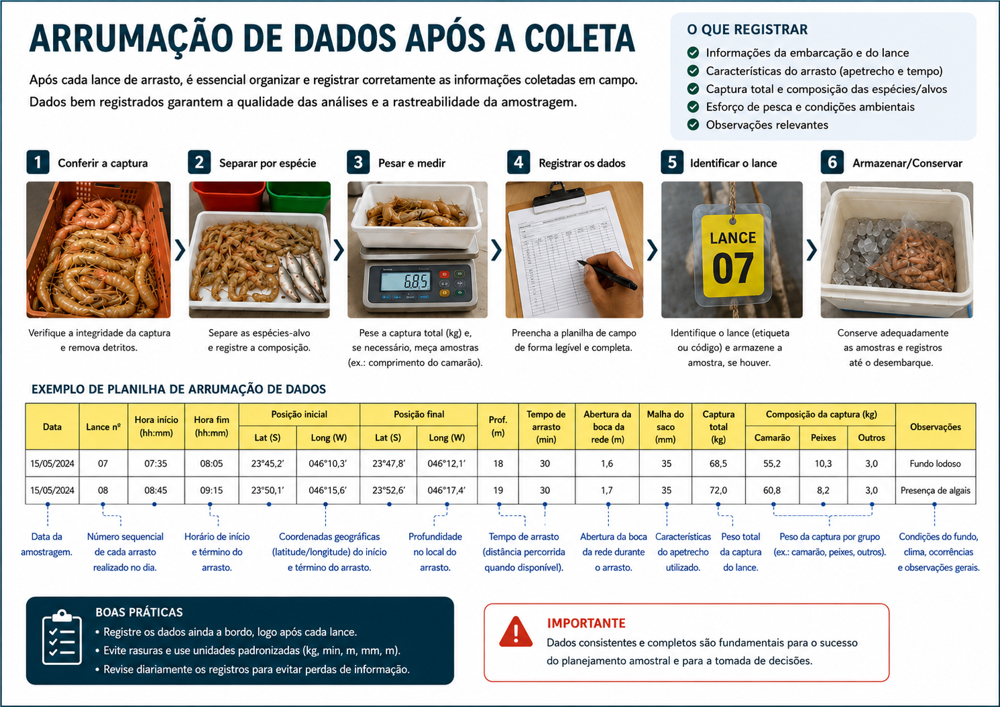

## Introdução

Este estudo tem como finalidade realizar um levantamento quantitativo da captura de camarão em diferentes períodos do ano e em locais distintos. A investigação irá fornecer informações essenciais para a gestão sustentável dos recursos pesqueiros locais, promovendo práticas pesqueiras responsáveis e auxiliando na compreensão dos fatores ambientais e logísticos que afetam as capturas.

## Objetivos e Hipóteses

O objetivo principal é avaliar a quantidade de camarão capturada ao longo de diferentes períodos e locais específicos, buscando determinar:

-   Diferenças significativas nas quantidades capturadas em função dos locais de coleta.
-   A influência dos períodos do ano nas taxas de captura.

As hipóteses iniciais estabelecidas são:

-   A captura de camarão é significativamente diferente entre os locais escolhidos.
-   O período do ano tem impacto na quantidade de camarão capturado.

## Metodologia

### Variáveis

Durante a coleta, as seguintes variáveis serão monitoradas:

-   Data da coleta
-   Fase lunar
-   Direção e intensidade do vento
-   Tipo de petrecho utilizado
-   Duração do esforço pesqueiro (em horas)
-   Peso total capturado de camarão (kg)
-   Peso total da fauna acompanhante (kg)
-   Local específico de captura

### Logística

As coletas serão realizadas utilizando embarcação própria com capacidade adequada para pesca comercial e experimental (@fig-barco) . As capturas serão pesadas imediatamente após a coleta utilizando uma balança digital de precisão.

Inicialmente, os dados serão anotados em planilha física ou caderno específico para registro das informações e posteriormente digitalizados em dispositivos eletrônicos como tablets ou notebooks. Durante todo o processo será observado o período de defeso para atender às regulamentações ambientais vigentes.

{#fig-barco fig-cap="Figura 1: Embarcação típica utilizada para coleta de camarão." fig-align="center" width="80%"}

### Pontos e Tempos de Coleta

O estudo será conduzido em três áreas principais, separadas por uma distância mínima de 5 km. Dentro de cada área principal, serão definidos sub-pontos com raio de 50 metros para garantir a representatividade das amostragens.

Cada ponto será avaliado em quatro tempos distintos (T1 a T4), distribuídos aleatoriamente ao longo do período do estudo para assegurar uma distribuição homogênea e representativa temporalmente.

## Estrutura de Dados

Para garantir uma análise eficiente posterior no ambiente R, a planilha Excel terá as seguintes colunas padronizadas:

| Coluna                      | Tipo de Dado |
|-----------------------------|--------------|
| Data                        | Data         |
| Fase_Lunar                  | Categórico   |
| Direcao_Vento               | Categórico   |
| Forca_Vento                 | Categórico   |
| Tipo_Petrecho               | Categórico   |
| Duracao_Esforco_Pesca_horas | Numérico     |
| Peso_Camarao_kg             | Numérico     |
| Peso_Fauna_kg               | Numérico     |
| Local_Captura               | Categórico   |

A @fig-planilha mostra um exemplo da estruração de uma planilha a ser preenchida durante a relização do estudo que será conduzido . Poderá ser algo similar, dependo do seu tipo de estudo

{#fig-planilha fig-align="center"}

## Importação e Tratamento Inicial dos Dados em R

```{r}
#| warning: false
library(tidyverse)
library(readxl)

# Caminho do arquivo Excel
caminho_arquivo <- "dados/captura_camarao.xlsx"

# Leitura dos dados
dados_camarao <- read_excel(caminho_arquivo, sheet = 1) |> 
  janitor::clean_names() |> 
  mutate(
    data = lubridate::dmy(data),
    fase_lunar  = factor(fase_lunar, levels = c("Nova", "Crescente", 
                                                "Cheia", "Minguante")),
    tipo_petrecho = as.factor(tipo_petrecho),
    direcao_vento = as.factor(direcao_vento),
    forca_vento = factor(forca_vento, levels = c("Fraco", "Moderado", 
                                                 "Forte")),
    local_captura = as.factor(local_captura)
  )

glimpse(dados_camarao)

saveRDS(dados_camarao, "dados/dados_camarao_tratados.rds")
```

## Explicação do tipo de salvamento RDS

Este procedimento garante uma estrutura limpa e adequada dos dados para futuras análises estatísticas robustas e precisas. Quando você salva um objeto em R usando a função `saveRDS()`, como no exemplo:

```{r}
#| eval: false

saveRDS(dados_camarao, "dados/dados_camarao_tratados.rds")
```

As **principais características** desse tipo de salvamento são:

### ✅ **Características do `saveRDS()`**:

-   **Salva um único objeto R**: apenas `dados_camarao` neste caso.

-   **Formato binário**: eficiente em espaço e leitura.

-   **Preserva a estrutura completa** do objeto (tipos, fatores, listas, classes S3/S4, etc.).

-   **Não salva o nome do objeto**: ao carregar, você precisa atribuir a um nome:

    ```{r}
    #| eval: false
    dados <- readRDS("dados/dados_camarao_tratados.rds")
    ```

-   **Ideal para uso modular**: muito útil para salvar objetos intermediários ou tratados em pipelines (como em modelos, conjuntos tratados, objetos de regressão, etc.).

<!-- -->

-   **Compatível com versionamento**: fácil de usar com `git` e outros sistemas.
