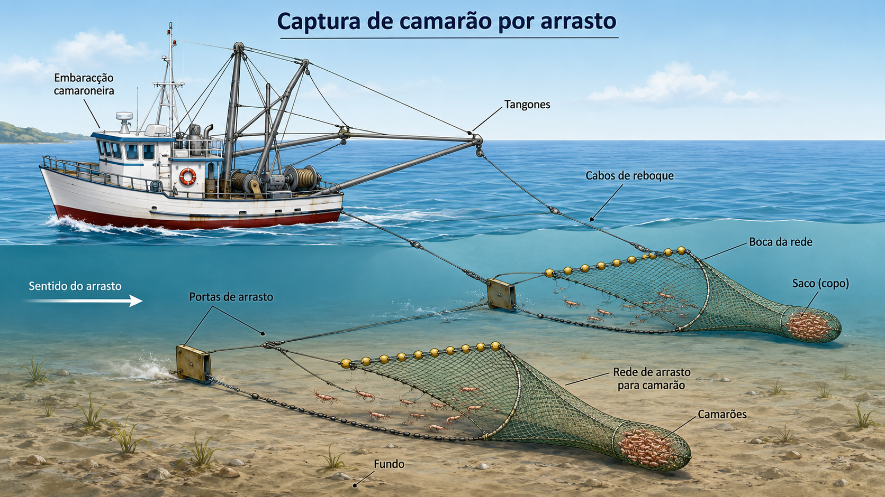

```{r setup}
#| include: false
library(EAPADados)
library(ggplot2)
library(dplyr)

ocean <- c(NAVY = "#0F3B5F", TEAL = "#2E7D8F", SEAFOAM = "#62B6B7",
           AMBER = "#E89B3C", CORAL = "#E76F51")
theme_set(theme_minimal(base_size = 11))
```

::: {.callout-note .destaque icon=false}
## Já passou por isso?

O barco está abastecido, a rede a postos, e você prestes a embarcar. Mas pare um instante: *você já sabe exatamente o que vai medir lá fora?* Quais variáveis anotar a cada lance, em que unidade pesar a captura, onde e quando soltar a rede? Se a resposta não estiver pronta **antes** de soltar as amarras, nenhum software conserta depois. O planejamento acontece em terra — e é ele que decide quais análises serão possíveis.
:::

Começa aqui a unidade **Antes da análise**, e o nome diz a que veio: quase tudo que decide a qualidade de um estudo acontece *antes* de apertar o botão do teste. O caminho é **da pergunta aos dados** — primeiro a **pergunta**, o **desenho** do estudo e as **variáveis** (é o assunto deste capítulo); depois, com os dados em mãos, **organizá-los, descrevê-los e visualizá-los** (o capítulo seguinte). Só ao fim desse trajeto é que se escolhe, com segurança, o procedimento estatístico. É também a primeira vez que os três lados do ecossistema EAPA andam juntos de ponta a ponta: o **livro** explica o raciocínio, o **EAPADados** fornece os dados reais da pesca e da aquicultura, e a **CatalyseR** conduz a análise e exporta o projeto `.qmd` para você terminar no RStudio.

Há uma ordem natural nas coisas, e ela costuma ser invertida. A pressa é coletar logo, e só na frente do computador perguntar "que teste eu uso agora?". Acontece que essa pergunta tem resposta muito antes: **o tipo de estudo determina os dados que você vai coletar, como coletá-los e como organizá-los** — e, com isso, decide de antemão quais análises serão possíveis, quais pressupostos elas exigirão e que cuidados a coleta impõe. Planejar a coleta é, na prática, **escolher antecipadamente o teste**.

Daí a importância deste capítulo, que talvez seja o mais teórico do livro e, ainda assim, um dos mais decisivos. Não há linha de código que recupere um dado que não foi registrado, nem análise que salve uma amostra colhida no improviso. Por outro lado, um conjunto bem planejado e arrumado desde o início — na filosofia *tidy*, cada linha uma observação, cada coluna uma variável, como vimos na Unidade I — praticamente se oferece à análise correta.

O planejamento tem dois grandes ramos, e eles dão nome às duas seções deste capítulo, espelhando o menu **Planejando sua Pesquisa** da CatalyseR. Quando observamos a natureza como ela é, sem intervir, fazemos **planejamento observacional**: decidimos *quem* observar e *como sortear* esses indivíduos. Quando intervimos de propósito — atribuindo tratamentos e controlando condições —, fazemos **planejamento experimental**. O primeiro descreve e compara o que existe; o segundo permite falar em **causa**.

| Ramo (menu CatalyseR) | O que se faz | Pergunta típica | Para onde leva |
|:---|:---|:---|:---|
| Planejamentos Observacionais | observar sem intervir; **sortear** quem observar | como está a população? | descrição, comparação, correlação |
| Planejamentos Experimentais | **intervir**; atribuir tratamentos | qual o efeito de *X* sobre *Y*? | ANOVA, regressão |

: Os dois ramos do planejamento e o que cada um habilita. {#tbl-ramos tbl-colwidths="[26,28,24,22]"}

## Por que o planejamento vem antes de tudo

Quase nunca conseguimos medir a população inteira. Não há tempo, combustível nem tripulação para pesar todo o camarão de um estuário ou medir todos os peixes de um açude. Então **amostramos**: tomamos uma parte para inferir sobre o todo. E aqui mora a primeira decisão de peso, porque uma amostra só representa a população se for tomada com honestidade.

A única defesa real contra o viés é o **acaso**. Parece contraintuitivo confiar no sorteio, mas é justamente ele que impede que a amostra reflita as suas preferências em vez da realidade. O "lugar onde sempre pesco" rende mais camarão porque você o escolheu por isso — e essa escolha contamina qualquer conclusão. Sortear quem entra na amostra é o que torna possível generalizar do pedaço para o todo.

A segunda decisão é o formato. Dados pensados desde a planilha de campo no formato *tidy* chegam ao R prontos para virar fatores, gráficos e testes. Dados anotados de qualquer jeito — unidades misturadas, totais no meio das observações, cor como informação — fecham portas que nenhum código reabre. O fio condutor do capítulo é este, e vale repetir: **a forma de coletar decide a forma de analisar**.

## Planejamentos Observacionais

Começamos pelo ramo em que apenas observamos. Aqui o objetivo é descrever uma população ou comparar grupos que já existem — locais, períodos, sexos — sem mexer em nada. A ferramenta central é a **amostragem probabilística**: todo indivíduo tem uma probabilidade conhecida de ser sorteado, e é isso que garante a representatividade. A CatalyseR oferece os três métodos mais usados na pesca, e é por eles que vamos.

### Amostragem Aleatória Simples (AAS)

É a base de tudo, e a ideia não poderia ser mais simples: todo indivíduo da população tem **a mesma chance** de ser sorteado, como tirar nomes de um chapéu. Imagine que o defeso abriu por dezesseis dias e você só tem perna para coletar em quatro deles. Em vez de escolher "os dias de tempo bom" (que enviesariam a captura), você sorteia:

```{r}
#| label: aas
set.seed(2026)
dias_possiveis <- 1:16
dias_coleta <- sample(dias_possiveis, size = 4)   # sorteio sem reposição
sort(dias_coleta)
```

Pronto: quatro dias escolhidos pelo acaso, sem a sua mão no meio. A AAS é honesta e fácil, mas tem um ponto cego — ela ignora qualquer estrutura conhecida da população. Se metade do estuário é mangue e metade é praia, um sorteio simples pode, por azar, cair quase todo num lado só. Quando sabemos que existe essa estrutura, vale usá-la a nosso favor, e é o que faz o método seguinte.

### Amostragem Estratificada Proporcional (AEP)

Estratificar é dividir a população em subgrupos homogêneos — os **estratos** — e amostrar dentro de cada um. Se as três áreas de um estuário diferem entre si, elas viram os estratos; aí garantimos que nenhuma fique de fora e, de quebra, já saímos com os grupos prontos para comparar. Na alocação **proporcional**, o tamanho da amostra em cada estrato acompanha o tamanho do estrato: áreas maiores recebem mais pontos.

```{r}
#| label: aep
estratos <- data.frame(
  area = c("Área 1", "Área 2", "Área 3"),
  N    = c(500, 300, 200)            # tamanho de cada estrato
)
n_total <- 50
estratos$n_h <- round(n_total * estratos$N / sum(estratos$N))
estratos
```

A maior das áreas levou metade da amostra; a menor, um quinto. Esse é o método certo quando você sabe que um fator — local, período, profundidade — influencia forte a resposta: ele protege a comparação ao assegurar que cada subgrupo importante seja representado na medida do seu peso.

### Amostragem Sistemática (AS)

Às vezes a população chega em fila: lances ao longo de um dia, peixes saindo da rede um após o outro, indivíduos numa esteira de triagem. Aí é prático sortear apenas o **ponto de partida** e seguir a intervalos fixos. O passo é $k = N/n$ — a cada $k$ indivíduos, um entra na amostra.

```{r}
#| label: as-sistematica
N <- 200; n <- 8
k <- floor(N / n)              # passo de amostragem
set.seed(2026)
inicio <- sample(1:k, 1)       # sorteia só o ponto de partida
amostra <- seq(inicio, by = k, length.out = n)
amostra
```

É rápida e cobre a fila de ponta a ponta. O cuidado é com **padrões cíclicos**: se a lista tem um ritmo que coincide com o passo $k$ — digamos, a rede sempre sobe mais cheia de manhã e você acaba pegando só as manhãs —, a amostra fica enviesada justamente por causa da regularidade. Quando não há esse risco, a sistemática é uma escolha econômica e elegante.

### Estudo de caso: captura de camarão por arrasto

Vamos juntar tudo num exemplo real. Queremos avaliar **quanto camarão se captura** ao longo de diferentes períodos do ano e em locais distintos de um estuário — informação valiosa para a gestão do recurso. Duas perguntas guiam o estudo: *a captura difere entre os locais?* e *o período do ano afeta a quantidade capturada?* Cada pergunta já é, no fundo, uma hipótese à espera de um teste.

A captura é feita por **arrasto**, com a embarcação rebocando a rede pelo fundo (@fig-barco). Reparar nesse desenho não é detalhe: o petrecho, a abertura da boca da rede, o tempo de arrasto e a velocidade definem o **esforço de pesca** — e é esse esforço que precisaremos registrar para que as capturas sejam comparáveis entre si.

{#fig-barco width=85%}

Aqui está o coração do planejamento observacional: a lista de variáveis não se improvisa no convés, ela se decide na escrivaninha. Para responder às perguntas, definimos de antemão o que será anotado a cada lance — *quando e em que condições* (data, fase lunar, vento), *como se pescou* (petrecho e duração do esforço, para padronizar), *o que se capturou* (peso de camarão e da fauna acompanhante, em quilogramas) e *onde* (o local). Note que cada variável já nasce com um **tipo** declarado: fase lunar e local são categóricas; pesos e duração, numéricas contínuas. Decidir o tipo agora é decidir, desde já, o que se poderá calcular depois.

Tão importante quanto *o que* medir é *como* registrar. A captura é pesada a bordo, logo após cada lance, sempre na **mesma unidade** e com o mesmo número de casas decimais. As informações vão primeiro para uma planilha de campo à prova de respingos e só depois são digitalizadas. A @fig-planilha mostra essa rotina de bordo — conferir, separar, pesar, registrar lance a lance, num formato que já é quase *tidy*: cada linha um lance, cada coluna uma variável.

{#fig-planilha width=95%}

E o desenho da coleta? Ele combina cuidado no espaço e no tempo. No **espaço**, escolhem-se três áreas separadas por alguns quilômetros — para que sejam de fato distintas —, e elas funcionam como estratos. No **tempo**, cada ponto é visitado em vários momentos distribuídos ao acaso ao longo do estudo, para que nenhuma fase do ano fique sobre ou sub-representada. É, na prática, uma amostragem **estratificada** (as áreas) com **casualização** temporal — exatamente os métodos que acabamos de ver, trabalhando juntos.

Quando essa planilha estiver pronta, ela alimentará a comparação que motivou o estudo: a **captura por unidade de esforço** (CPUE) entre locais e entre períodos. Como CPUE costuma fugir da normalidade, entra ali um teste não paramétrico como o de Kruskal-Wallis, que veremos na unidade de inferência. O conjunto `captura_petrechos`, do pacote `EAPADados`, traz justamente esse tipo de dado de captura por aparelho de pesca, e será o campo de prática lá adiante. O planejamento que fizemos aqui é o que torna aquela análise possível.

### Estudo de caso: a força da arrebentação

Mudemos de praia — literalmente. Na orla, a **zona de arrebentação** (a faixa em que as ondas quebram) abriga uma comunidade própria de peixes, e é natural perguntar: *essa comunidade muda conforme a força da arrebentação?* Foi exatamente o que investigaram @felix2006 no litoral do Paraná, num caso que virou referência de como o planejamento decide o destino da análise.

O desenho parecia robusto. Escolheram **três praias** ao longo de um gradiente de exposição às ondas — uma de energia baixa, uma média e uma alta — e, durante **doze meses**, fizeram **cinco arrastos** com rede picaré de 30 metros em cada praia. São cento e oitenta arrastos: uma montanha de dados, poder estatístico aparentemente de sobra.

Mas repare onde mora a cilada. Cada **nível de energia** foi representado por **uma única praia**: a energia baixa *é* a Praia 1, a média *é* a Praia 2, a alta *é* a Praia 3. Energia e identidade da praia ficaram **confundidas** — grudadas, impossíveis de separar. Os cinco arrastos não são cinco réplicas do nível de energia; são **subamostras** de uma praia só. No nível em que a pergunta de fato vive — a energia da arrebentação —, o número de unidades independentes é **um**. É a pseudo-replicação de novo [@hurlbert1984], só que agora no espaço, não no tanque.

A consequência é direta. Qualquer diferença entre as praias pode ser efeito da arrebentação, sim — mas pode também ser granulometria, influência estuarina, presença de microhabitats ou qualquer atributo que aquelas três praias específicas não compartilham. O teste vai mesmo acusar diferença (ela existe), só que não consegue dizer **de quê**. É como provar um único prato em três restaurantes e concluir algo sobre a culinária da cidade inteira: você comparou três pratos, não três cozinhas.

E não adianta coletar mais. Doze meses de uma praia continuam sendo uma praia; somar arrastos engorda a estimativa *daquela* praia, não cria praias novas. O conserto não é mais esforço — é esforço no **lugar certo**. Para testar energia, cada nível precisa de **várias praias independentes** (pelo menos três). Aí a variação natural entre praias de um mesmo nível deixa de ser um ruído ignorado e passa a ser a **régua** contra a qual o efeito da energia é medido [@underwood1997]. Os arrastos seguem valiosos, mas no seu devido papel: subamostras que afinam a medida de cada praia, sem se passar por réplicas do fator.

Vale fixar o vocabulário, porque ele é a fonte de metade das confusões. A **réplica** é a unidade independente que recebe o nível do fator — aqui, a **praia**. A **subamostra** é cada coleta feita *dentro* dessa unidade — aqui, cada **arrasto**. Os cinco arrastos de uma praia não são cinco praias: são cinco olhadas na mesma praia, que servem para descrevê-la com mais firmeza. Por isso, na prática, costuma-se **tirar a média dos cinco arrastos** de cada praia e levar esse único valor representativo para a comparação entre os níveis de energia — assim cada praia entra na análise como **uma** unidade, que é exatamente o que ela é. A hierarquia fica: **força da arrebentação** (fator) → **praia** (réplica) → **arrasto** (subamostra).

Fica a pergunta que desarma a armadilha — a mesma de sempre, agora vestida de maré: *o que, exatamente, recebeu o nível de energia de forma independente?* A praia. E é ela que você conta como réplica. O @fig-arrebentacao resume, passo a passo, o plano de coleta que transforma essa pergunta num desenho capaz de sustentar a resposta.

![Planejamento amostral na zona de arrebentação. Para testar se a comunidade de peixes varia com a força das ondas, o gradiente de energia (baixa, média e alta) recebe, em cada nível, três praias independentes (P1–P9): as réplicas espaciais verdadeiras do fator. Em cada praia fazem-se vários arrastos de picaré padronizados, que são subamostras — tira-se a média dos cinco arrastos para obter um único valor representativo por praia. A faixa inferior fixa a hierarquia amostral (força da arrebentação → praia → arrasto), e a coluna à direita resume os passos práticos da coleta. É esse desenho que separa o efeito da arrebentação da identidade de cada praia. Adaptado de @felix2006.](../../images/infografico_arrebentacao_planejamento.png){#fig-arrebentacao width=80%}

## Planejamentos Experimentais

Até agora apenas observamos. Mudemos de chave: e se quisermos saber se uma **ração nova** faz o peixe crescer mais? Observar não basta — precisamos **intervir**, dando a ração a uns e não a outros, e comparar. Essa é a essência do **experimento**, e é o que nos autoriza a falar em causa, não apenas em associação. Mas intervir tem regras; sem elas, você nunca saberá se mediu a ração ou o acaso.

Três princípios sustentam todo bom experimento. A **repetição** (réplicas) nos dá uma medida do acaso, sem a qual não há como julgar se uma diferença é real ou sorte. A **casualização** (sortear quem recebe cada tratamento) protege contra vieses que não controlamos — aquele tanque que pega mais sol, aquele lote de peixes de outra origem. E o **controle local** (blocos) isola fontes de variação conhecidas, como a posição no viveiro ou o dia da medição. Os delineamentos clássicos, que veremos a seguir, são apenas combinações inteligentes desses três princípios — e a CatalyseR oferece cinco deles.

### A armadilha da pseudo-replicação

Antes dos delineamentos, um aviso que vale por um capítulo inteiro.

::: {.callout-important .destaque icon=false}
## Conte réplicas, não subamostras

Réplica de verdade é a **unidade experimental independente** — aquela que recebeu o tratamento de forma autônoma. Se você aplica uma ração a **um** tanque e depois pesa 50 peixes desse tanque, você **não** tem 50 réplicas: tem uma só. Os 50 peixes dividem a mesma água, a mesma temperatura, a mesma história. Tratá-los como independentes é cometer **pseudo-replicação** — um erro tão comum quanto grave, que infla artificialmente o tamanho da amostra e fabrica significâncias falsas.

A pergunta que desarma a cilada é simples: *o que, exatamente, recebeu o tratamento de forma independente?* A resposta é a sua unidade experimental — e é ela que você conta como réplica.
:::

### DIC — Inteiramente Casualizado

O **Delineamento Inteiramente Casualizado** é o mais simples: os tratamentos são sorteados livremente entre as unidades, sem nenhuma restrição. Ele pede condições homogêneas — um laboratório, ou um conjunto de gaiolas idênticas num mesmo tanque, onde nada além do tratamento distingue uma unidade da outra. É o desenho do experimento das rações iso-proteicas para bagres que analisaremos por ANOVA mais à frente.

Montar um DIC é sortear. Suponha quatro rações (A, B, C, D) e cinco gaiolas por ração:

```{r}
#| label: dic
set.seed(2026)
tratamentos <- rep(c("A", "B", "C", "D"), each = 5)
plano_dic <- data.frame(gaiola = 1:20, racao = sample(tratamentos))  # casualização
head(plano_dic)
```

O `sample()` embaralha as rações entre as gaiolas — é a casualização em ação. A CatalyseR faz exatamente isso quando você escolhe *DIC* no menu, e ainda desenha o **croqui**, o mapa do experimento que você leva para o campo:

```{r}
#| label: dic-croqui
#| fig-cap: "Croqui de um DIC com quatro rações e cinco repetições: as 20 gaiolas dispostas numa grade, com o tratamento sorteado para cada uma."
plano_dic$col <- ((plano_dic$gaiola - 1) %% 5) + 1
plano_dic$lin <- ((plano_dic$gaiola - 1) %/% 5) + 1

ggplot(plano_dic, aes(col, lin, fill = racao)) +
  geom_tile(color = "white", linewidth = 1.2) +
  geom_text(aes(label = racao), color = "white", fontface = "bold") +
  scale_fill_manual(values = unname(ocean[c("NAVY","TEAL","AMBER","CORAL")])) +
  scale_y_reverse() +
  labs(x = NULL, y = NULL, fill = "Ração") +
  theme(axis.text = element_blank(), panel.grid = element_blank())
```

### DBC — Blocos Casualizados

E quando as condições **não** são homogêneas? Imagine um viveiro comprido em que a água corre mais fria numa ponta do que na outra. Se você casualizar sem cuidado, a temperatura vira um carona clandestino na comparação das rações. O **Delineamento em Blocos Casualizados** resolve isso agrupando as unidades em **blocos** homogêneos — cada faixa do viveiro é um bloco — e sorteando **todos** os tratamentos dentro de cada bloco. Assim, a variação entre blocos é isolada e tirada do caminho.

```{r}
#| label: dbc
set.seed(2026)
trats <- c("A", "B", "C")
plano_dbc <- do.call(rbind, lapply(1:4, function(b) {
  data.frame(bloco = b, posicao = 1:3, racao = sample(trats))  # sorteio dentro do bloco
}))
head(plano_dbc, 6)
```

Repare que o sorteio acontece **dentro** de cada bloco: todo bloco recebe A, B e C, em ordem própria. É essa restrição que separa o DBC do DIC.

### DQL — Quadrado Latino

Às vezes não há uma, mas **duas** fontes de variação a controlar — por exemplo, a linha e a coluna de uma bancada de aquários, onde a luz varia num sentido e a temperatura no outro. O **Delineamento em Quadrado Latino** dá conta das duas ao mesmo tempo: dispõe os tratamentos de modo que cada um apareça **uma vez em cada linha e uma vez em cada coluna**.

```{r}
#| label: dql
trats <- c("A", "B", "C", "D")
ql <- outer(0:3, 0:3, function(i, j) trats[((i + j) %% 4) + 1])
ql
```

Cada letra ocupa cada linha e cada coluna uma única vez — luz e temperatura ficam, ambas, equilibradas entre os tratamentos. A restrição do método é geométrica: o número de tratamentos tem de ser igual ao de linhas e ao de colunas.

### Fatorial

Até aqui variamos um fator de cada vez. Mas e se a **alimentação** e a quantidade de **abrigo** importarem juntas — e, pior, se o ganho do suplemento na ração mudar conforme o abrigo disponível? Estudá-los em experimentos separados nunca revelaria isso. O **delineamento fatorial** cruza os fatores e testa todas as combinações de uma vez, o que permite enxergar não só o efeito de cada um, mas a **interação** entre eles: o caso em que o efeito de um depende do nível do outro.

A @fig-fatorial mostra um exemplo concreto. Cruzamos a **alimentação** (Fator A: ração padrão, $A_0$, ou com suplemento, $A_1$ — dois níveis) com a **vegetação/abrigo** (Fator V: baixa, média ou alta — três níveis). São $2 \times 3 = 6$ combinações, e cada aquário recebe uma delas. Repare que o desenho é, ao mesmo tempo, **fatorial e em blocos**: as seis combinações aparecem uma vez em cada bloco, sorteadas dentro dele, e os cinco blocos controlam variações do ambiente — posição na estante, luminosidade — como vimos no DBC. Cinco blocos × seis combinações dão trinta aquários, e cada aquário é uma unidade experimental.

{#fig-fatorial width=90%}

Montar esse plano é cruzar os fatores e sortear as combinações dentro de cada bloco:

```{r}
#| label: fatorial
set.seed(2026)
combinacoes <- expand.grid(
  alimentacao = c("A0", "A1"),               # padrão / com suplemento
  vegetacao   = c("V1", "V2", "V3")          # abrigo baixo / médio / alto
)                                            # 2 x 3 = 6 combinações

plano_fat <- do.call(rbind, lapply(1:5, function(bloco) {
  ordem <- sample(nrow(combinacoes))         # sorteio dentro do bloco
  data.frame(bloco = bloco, aquario = 1:6,
             combinacoes[ordem, ], row.names = NULL)
}))
head(plano_fat)
```

O `expand.grid()` gera as seis combinações; o `sample()` as embaralha dentro de cada bloco. A interação é a verdadeira recompensa do fatorial — é ela que responde perguntas do tipo "o suplemento na ração só compensa quando há bastante abrigo?".

### Parcelas Subdivididas (Split-Plot)

Chegamos ao delineamento mais sofisticado da lista — e ao que mais se presta a confusão. Ele aparece quando um dos fatores só pode ser aplicado a uma área grande, e o outro, a subdivisões dela. Pense em **temperatura da água**, que vale para um tanque inteiro, combinada com **linhagem do peixe**, que você consegue separar em compartimentos dentro do tanque. A temperatura vai na **parcela principal**; a linhagem, nas **subparcelas**.

A consequência é que há **dois sorteios**, em dois níveis. Primeiro, dentro de cada bloco, sorteiam-se os níveis do fator principal entre as parcelas grandes. Depois, dentro de cada parcela grande, sorteiam-se os níveis do fator subdividido entre as subparcelas. A @fig-split-plot mostra essa aleatorização em dois estágios.

{#fig-split-plot width=70%}

Esse arranjo se monta sorteando em duas etapas:

```{r}
#| label: split-plot
set.seed(2026)
A <- c("A1", "A2", "A3")            # fator principal (parcela): ex. temperatura
B <- c("B1", "B2", "B3", "B4")      # fator subdividido (subparcela): ex. linhagem

plano_sp <- do.call(rbind, lapply(1:3, function(bloco) {
  ordem_A <- sample(A)                                   # 1o sorteio: parcelas no bloco
  do.call(rbind, lapply(seq_along(ordem_A), function(p) {
    data.frame(bloco = bloco, parcela = p, fator_A = ordem_A[p],
               sub = 1:length(B), fator_B = sample(B))   # 2o sorteio: subparcelas
  }))
}))
head(plano_sp, 8)
```

O detalhe que **não** pode ser ignorado é a contabilidade do erro. Por haver dois níveis de sorteio, há **duas fontes de erro**: o fator principal é julgado contra o erro entre parcelas; o fator subdividido e a interação, contra o erro entre subparcelas. Tratar tudo como um experimento simples — o engano clássico — leva a testar o fator principal com a régua errada. É um parente próximo da pseudo-replicação, e o motivo de o split-plot exigir uma análise com a estrutura certa.

### Estudo de caso experimental

Um exemplo aterrissa todos esses princípios. No experimento das rações iso-proteicas para bagres, quatro rações (A a D) são distribuídas ao acaso entre gaiolas-rede idênticas num mesmo tanque, com cinco réplicas cada — um **DIC** de manual. As gaiolas são idênticas (condições homogêneas), o sorteio protege contra vieses, e as cinco réplicas medem o acaso. No fim, pesam-se os peixes e comparam-se as médias.

E como se comparam quatro médias de uma vez? Com a **ANOVA**, que veremos na unidade de inferência. Eis a grande recompensa de planejar direito: um experimento bem desenhado já nasce pedindo a análise certa. O delineamento aqui escolhido entrega, de bandeja, a ANOVA que aplicaremos adiante. O conjunto `isoproteica_bagre`, do `EAPADados`, guarda esses dados para a nossa prática.

## Do mouse ao código: planejar na CatalyseR

Tudo o que percorremos neste capítulo cabe num só lugar da IDE: o menu **Planejando sua Pesquisa**, com seus dois submenus — *Planejamentos Observacionais* e *Planejamentos Experimentais*. Você escolhe o método (uma das amostragens ou um dos delineamentos), informa os níveis, repetições e blocos, e a CatalyseR sorteia o plano e desenha o croqui na tela. Nada de digitar `sample()` na mão, a menos que você queira.

E aí entra a ponte que dá identidade ao ecossistema: ao clicar em **exportar**, a interface gera um **Projeto R (.zip)** com o script de sorteio e um relatório Quarto já preenchido — os mesmos templates `relatorio_sampling.qmd` e `relatorio_experimental_design.qmd`. Você sai da tela com o plano de coleta documentado e reproduzível, pronto para levar a campo. É o "do mouse ao código" aplicado ao começo de tudo: a IDE planeja com você apontando e clicando, e te devolve o código que registra e reproduz cada decisão.

::: {.callout-tip .destaque icon=false}
## Resumo do capítulo

Antes do primeiro número vem a decisão que comanda todas as outras: **planejar a coleta é escolher o teste**. O planejamento tem dois ramos. No **observacional**, não intervimos — apenas sorteamos quem observar, com **amostragem aleatória simples** (todos com a mesma chance), **estratificada proporcional** (cada subgrupo na medida do seu peso) ou **sistemática** (ponto de partida sorteado e passo fixo). No **experimental**, intervimos para falar de causa, sob três princípios — **repetição**, **casualização** e **controle local** —, e fugindo da **pseudo-replicação**, que confunde subamostras com réplicas. Os delineamentos combinam esses princípios: **DIC** para condições homogêneas, **DBC** para isolar uma fonte de variação, **DQL** para isolar duas, **fatorial** para estudar fatores e suas interações, e **parcelas subdivididas** quando há dois níveis de aplicação — e, com eles, duas fontes de erro. Todo estudo bem planejado já nasce pedindo a análise certa.
:::

::: {.callout-note icon=false}
## Para praticar

1. Liste as variáveis do estudo do camarão e classifique cada uma como nominal, ordinal, discreta ou contínua. Quais permitiriam uma comparação de médias? Quais, uma tabela de contingência?
2. Sorteie, por AAS, cinco dias de coleta entre vinte possíveis. Mude a semente (`set.seed`) e observe como o sorteio muda.
3. Você tem três áreas com 600, 300 e 100 indivíduos e quer uma amostra total de 40. Calcule, em R, a alocação proporcional por estrato.
4. Monte, em R, o plano de um DIC com casualização para três dietas em doze tanques.
5. Explique, com suas palavras, por que pesar trinta peixes de um único tanque tratado não gera trinta réplicas.
6. Num split-plot que cruza temperatura da água e linhagem do peixe, qual fator você poria na parcela principal e qual na subparcela? Por quê?
:::
