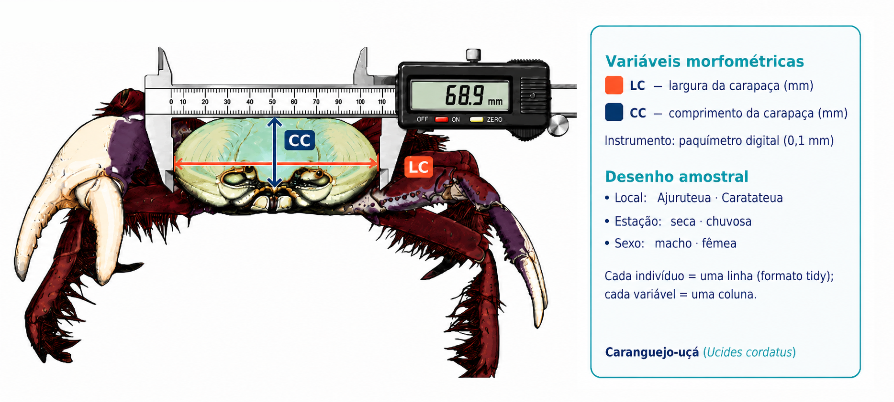

```{r setup}
#| include: false
library(EAPADados)
library(ggplot2)
library(dplyr)
library(flextable)

ocean <- c(NAVY = "#0F3B5F", TEAL = "#2E7D8F", SEAFOAM = "#62B6B7",
           AMBER = "#E89B3C", CORAL = "#E76F51")
theme_set(theme_minimal(base_size = 11))

data(biometria_caranguejos)
```

::: {.callout-note .destaque icon=false}
## Já passou por isso?

Lá na Unidade II, ao explorar os caranguejos de Bragança, um gráfico nos chamou a atenção: a largura e o comprimento da carapaça subiam juntos, numa nuvem que apontava para cima. Na hora dissemos que aquilo era *pista* de uma relação. Agora é hora de cumprir a promessa: traçar a **reta** que resume essa relação, medir sua força e usá-la para prever. É a **regressão linear simples**.
:::

A regressão linear simples ajusta uma **reta** entre duas variáveis numéricas — uma **preditora** (o $x$, aqui a largura da carapaça, LC) e uma **resposta** (o $y$, o comprimento, CC). A reta tem a forma de sempre:

$$
\widehat{CC} = \beta_0 + \beta_1 \cdot LC
$$

em que $\beta_0$ é o **intercepto** (o valor de CC quando LC = 0) e $\beta_1$ é a **inclinação** — o quanto o comprimento aumenta, em média, para cada milímetro a mais de largura. O método escolhe a reta que torna mínima a soma dos **quadrados dos resíduos** (as distâncias verticais dos pontos à reta); por isso se chama *mínimos quadrados ordinários*.

## Como os dados foram medidos

Antes dos cálculos, vale ver de onde vêm os números. Em cada caranguejo-uçá capturado, mediram-se, com a ajuda de paquímetro digital, duas dimensões da carapaça — a **largura** (LC) e o **comprimento** (CC), em milímetros —, anotando ainda o **local**, a **estação** e o **sexo** (@fig-medicao). Foi um estudo planejado: dois locais, duas estações e os dois sexos, com cada indivíduo virando uma linha no formato *tidy*.

{#fig-medicao width=100%}

E aqui entra uma ideia que atravessa toda a estatística: **amostras diferentes dão números diferentes**. Se outra equipe medisse outro punhado de caranguejos, a reta ajustada não sairia idêntica — o intercepto e a inclinação oscilariam um pouco. Por isso cada coeficiente vem acompanhado de um **erro padrão**, e a reta no gráfico vem com uma **faixa de confiança**: ambos medem essa incerteza da amostragem. A reta que estimamos é a melhor aposta a partir *desta* amostra — não uma verdade cravada.

## Antes da reta: por que filtrar os dados

Há uma armadilha aqui, e ela ensina muito. Se jogarmos **todos** os caranguejos num único modelo, a reta sai fraca:

```{r}
#| label: geral
modelo_geral <- lm(CC ~ LC, data = biometria_caranguejos)
summary(modelo_geral)$r.squared
```

Um $R^2$ de apenas **0,12** — a reta mal explica a relação. O motivo não é que largura e comprimento não se relacionem; é que a base **mistura grupos heterogêneos** (estações, locais e sexos com retas diferentes), e essa mistura embaralha o padrão. Esse é um lembrete valioso: às vezes o problema não está na análise, mas em **sobre quem** ela é feita. Quando subconjuntos têm comportamentos distintos, analisá-los juntos esconde o que cada um tem de claro.

Olhando por estação, a diferença salta aos olhos: na **estação seca** a relação é nítida; na chuvosa, dispersa. Vamos então **filtrar** os dados da estação seca e trabalhar com esse subconjunto homogêneo.

```{r}
#| label: filtro
caranguejos_seca <- biometria_caranguejos |>
  filter(Estacao == "Seca")

nrow(caranguejos_seca)
```

## Ajustando a reta

Com o subconjunto em mãos, o ajuste é uma linha de código — a função `lm()` (de *linear model*):

```{r}
#| label: ajuste
modelo <- lm(CC ~ LC, data = caranguejos_seca)
summary(modelo)
```

A leitura da saída:

```{r}
#| label: tbl-coef
#| tbl-cap: "Coeficientes do modelo de regressão de CC sobre LC, na estação seca."
coefs <- as.data.frame(round(coef(summary(modelo)), 4))
coefs <- cbind(Termo = rownames(coefs), coefs)
rownames(coefs) <- NULL
flextable_ocean(coefs)
```

A **inclinação** ($\beta_1$) ficou em torno de **1,03**: cada milímetro a mais de largura corresponde, em média, a cerca de 1,03 mm a mais de comprimento — ou seja, a carapaça cresce quase na proporção 1:1 entre as duas dimensões. O *p*-valor minúsculo confirma que a relação é real, não acaso. E o $R^2 \approx 0{,}97$ diz que a largura sozinha explica **97%** da variação do comprimento — uma reta excelente, bem diferente do modelo bagunçado da base inteira.

Com o modelo, **prever** é imediato. Para um caranguejo de 70 mm de largura:

```{r}
#| label: previsao
predict(modelo, newdata = data.frame(LC = 70))
```

## Conferindo os pressupostos

A regressão linear confia em alguns pressupostos sobre os **resíduos** — em especial, que eles se distribuem de forma aproximadamente **normal**. Um diagnóstico compacto é o **gráfico quantil-quantil (Q-Q)**: se os pontos acompanham a diagonal, a normalidade se sustenta.

```{r}
#| label: fig-qq
#| fig-cap: "Gráfico Q-Q dos resíduos: pontos próximos da linha indicam resíduos aproximadamente normais."
#| fig-width: 4.2
#| fig-height: 2.8
ggplot(data.frame(residuo = residuals(modelo)), aes(sample = residuo)) +
  stat_qq(color = ocean["TEAL"], size = 0.8) +
  stat_qq_line(color = ocean["CORAL"]) +
  labs(x = "Quantis teóricos", y = "Quantis dos resíduos")
```

## A reta sobre os dados

Por fim, a imagem que resume tudo: a nuvem de pontos, a reta ajustada e o **intervalo de confiança de 95% da média** (a sombra azul-clara em volta da reta) — a faixa que mede a incerteza sobre a *posição da reta*, estreita aqui porque o ajuste é muito bom.

```{r}
#| label: fig-reta
#| fig-cap: "Regressão de CC sobre LC na estação seca: a reta ajustada e o intervalo de confiança de 95% da média (sombra azul-clara)."
b   <- coef(modelo)
r2  <- summary(modelo)$r.squared
eq  <- sprintf("CC = %.2f + %.2f \u00b7 LC\nR\u00b2 = %.3f", b[1], b[2], r2)

ggplot(caranguejos_seca, aes(LC, CC)) +
  geom_point(color = ocean["TEAL"]) +
  geom_smooth(method = "lm", color = ocean["CORAL"], fill = "#A6C8E0") +
  annotate("text", x = min(caranguejos_seca$LC), y = max(caranguejos_seca$CC),
           hjust = 0, vjust = 1, label = eq, color = ocean["NAVY"], size = 4) +
  labs(x = "Largura da carapaça (mm)", y = "Comprimento da carapaça (mm)")
```

> A regressão de CC sobre LC, nos caranguejos da estação seca, estimou uma inclinação de `r round(coef(modelo)[2], 3)` mm de comprimento por mm de largura (intercepto `r round(coef(modelo)[1], 2)`), com *R²* de `r round(summary(modelo)$r.squared, 3)` — a largura da carapaça explica quase toda a variação do comprimento.

::: {.callout-tip .destaque icon=false}
## Resumo do capítulo

A regressão linear simples resume a relação entre duas variáveis numéricas numa **reta** de mínimos quadrados, lida por três números: o **intercepto**, a **inclinação** (quanto $y$ muda por unidade de $x$) e o **$R²$** (quanto da variação de $y$ a reta explica). No caminho, uma lição de ouro: a base inteira dava uma reta fraca ($R² = 0{,}12$) porque misturava grupos distintos; **filtrar** para a estação seca revelou uma relação quase perfeita ($R² \approx 0{,}97$). E nunca pule os **resíduos** — é neles que o modelo confessa se a reta serve.
:::

## Adendo: uma reta para cada sexo

E se machos e fêmeas tiverem retas diferentes? Basta colorir os pontos por **sexo** e deixar o `ggplot2` ajustar uma reta para cada grupo — com a respectiva equação ao lado, para comparação direta.

```{r}
#| label: fig-sexo
#| fig-cap: "Regressão de CC sobre LC por sexo, na estação seca: uma reta e uma equação para cada grupo."
# uma regressão para cada sexo
eqs <- caranguejos_seca |>
  group_by(Sexo) |>
  group_modify(~ data.frame(b0 = coef(lm(CC ~ LC, .x))[1],
                            b1 = coef(lm(CC ~ LC, .x))[2],
                            r2 = summary(lm(CC ~ LC, .x))$r.squared)) |>
  mutate(rotulo = sprintf("%s: CC = %.2f + %.2f\u00b7LC  (R\u00b2 = %.3f)",
                          Sexo, b0, b1, r2))

xr <- min(caranguejos_seca$LC); yr <- range(caranguejos_seca$CC)

ggplot(caranguejos_seca, aes(LC, CC, color = Sexo, fill = Sexo)) +
  geom_point(size = 1) +
  geom_smooth(method = "lm") +
  scale_color_manual(values = unname(ocean[c("TEAL", "CORAL")])) +
  scale_fill_manual(values = unname(ocean[c("TEAL", "CORAL")])) +
  annotate("text", x = xr, y = yr[2], hjust = 0, vjust = 1,
           label = eqs$rotulo[1], color = unname(ocean["TEAL"]), size = 3.5) +
  annotate("text", x = xr, y = yr[2] - 0.07 * diff(yr), hjust = 0, vjust = 1,
           label = eqs$rotulo[2], color = unname(ocean["CORAL"]), size = 3.5) +
  labs(x = "Largura da carapaça (mm)", y = "Comprimento da carapaça (mm)")
```

As duas retas ficam praticamente sobrepostas — a relação entre largura e comprimento é a mesma nos dois sexos. Se divergissem, seria sinal de que o sexo muda não só o *tamanho*, mas a própria *forma* de crescer.

::: {.callout-note icon=false}
## Para praticar

1. Refaça a regressão simples filtrando `Local == "Caratateua"` em vez de `Estacao == "Seca"`. O $R²$ muda muito? Por quê?
2. Ajuste o modelo na estação **chuvosa** e compare o $R²$ e a inclinação com os da seca. O que isso sugere sobre a biologia (ou sobre a coleta)?
3. Tome duas subamostras aleatórias de 100 caranguejos da estação seca (`slice_sample(n = 100)`), ajuste a reta em cada uma e compare o intercepto e a inclinação. Quanto eles variam de uma amostra para a outra?
:::
