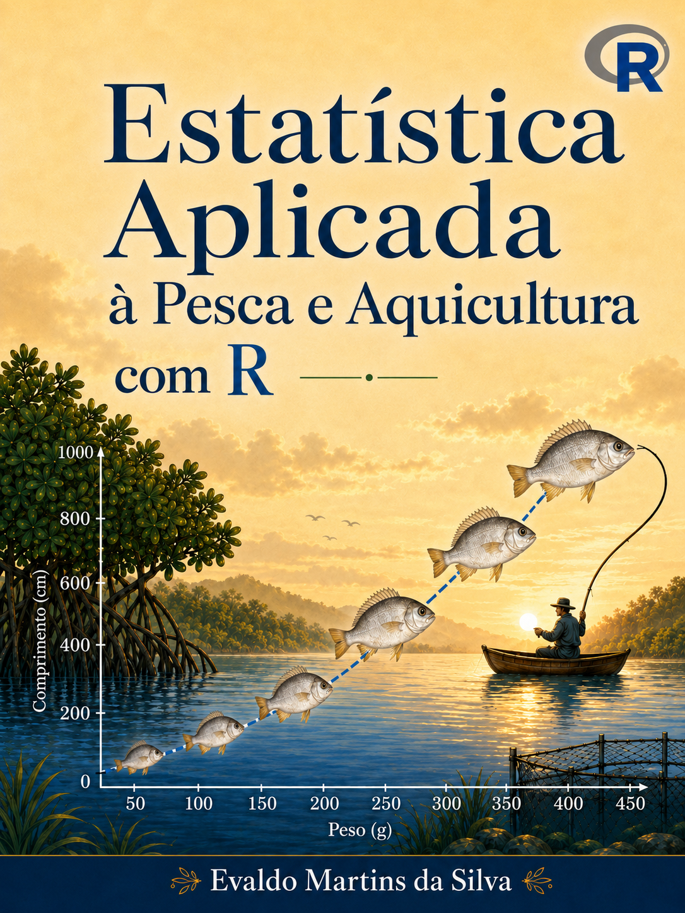

::: {.content-visible when-format="pdf"}
{width="100%"}


:::

# Prefácio {.unnumbered}

Há uma distância conhecida entre dominar a teoria estatística e conseguir aplicá-la a dados reais. Nas ciências pesqueiras e aquícolas, ela se acentua: falta material didático em português que ligue, de forma aplicada, os fundamentos da estatística aos problemas concretos de quem trabalha com a pesca e a aquicultura. Este livro nasce para encurtar essa distância, oferecendo a estudantes, docentes e técnicos um caminho prático (da pergunta de pesquisa ao resultado interpretado), apoiado na linguagem R.

Mais do que uma obra isolada, este livro é a face escrita de um ecossistema de ensino. As análises que ele apresenta nascem na **CatalyseR**, uma interface visual que conduz o usuário "do mouse ao código": a análise é feita apontando e clicando e, ao final, o usuário leva consigo o script R que a reproduz. Os dados que ilustram cada método vêm do pacote **EAPADados**, que reúne conjuntos reais da pesca e da aquicultura, sobretudo amazônica. Livro, interface e pacote foram pensados para andar juntos — o que se lê aqui é exatamente o que a interface executa e o que o pacote fornece.

A obra percorre os temas essenciais da estatística aplicada (da análise exploratória aos testes de hipóteses, da regressão à análise de variância), sempre com exemplos contextualizados e código reprodutível. A esses fundamentos somam-se alguns temas mais avançados, mas de uso corrente na pesquisa, como a análise multivariada, a regressão não linear e a confecção de mapas em R. A primeira edição foi mantida deliberadamente enxuta, concentrada nas análises já consolidadas, de modo a servir como um guia confiável e completo naquilo a que se propõe, deixando os demais temas mais avançados para edições futuras.

Recomenda-se ler este livro com o R aberto. Cada capítulo foi escrito para ser acompanhado na prática: instale o pacote de dados, execute os exemplos, gere os gráficos e produza os relatórios. É percorrendo esse caminho, e repetindo-o, que a fluência se constrói.

## Agradecimentos {.unnumbered}

Aos estudantes de graduação e pós-graduação da Universidade Federal do Pará, cuja participação ao longo dos anos foi essencial para o aprimoramento do ensino de estatística aqui consolidado.

Aos professores da UFPA que gentilmente cederam scripts e resultados de pesquisa, adaptados e incluídos como dados de apoio nas análises deste material.

À Editora da UFPA, pela valiosa ajuda na editoração deste livro e pelo cuidado com a qualidade do acabamento.

```{r}
#| echo: false

library(float)
knitr::opts_chunk$set(
  echo = TRUE,
  warning = FALSE,
  message = FALSE,
  cache = TRUE,
  fig.align = "center",
  fig.width = 5.0,
  fig.height = 3.5,
  dev = "png",
  comment = "|"
)
```

```{r}
#| include: false
knitr::write_bib( # cria automaticamente um databse .bib para pacotes R
  c(.packages(), 'bookdown', 'knitr', 'rmarkdown', 'fdth', 'ggplot2', 'EAPADados'),
  'packages.bib'
)

# Então una o conteúdo do packages.bib ao references.bib manualmente de tempos em tempos, evitando sobrescrever.
```
